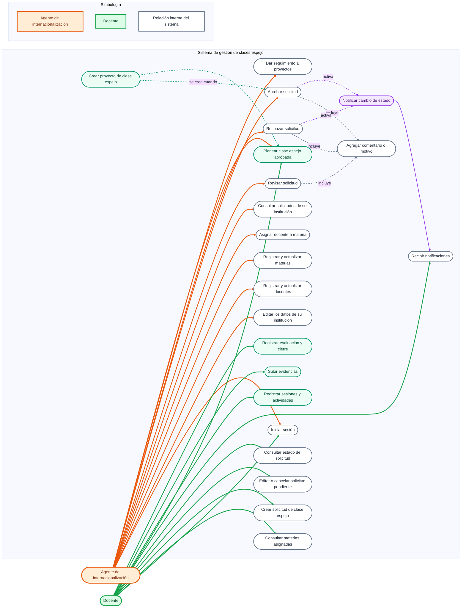

```mermaid
%%{init: {
    "theme": "base",
    "themeVariables": {
        "background": "#F5F7FA",
        "primaryTextColor": "#1F2937",
        "lineColor": "#64748B",
        "fontFamily": "Arial"
    }
}}%%

flowchart LR

    %% =========================
    %% ACTORES
    %% =========================

    Agente([Agente de internacionalización])
    Docente([Docente])


    %% =========================
    %% SISTEMA
    %% =========================

    subgraph Sistema["Sistema de gestión de clases espejo"]

        %% Autenticación
        UC1([Iniciar sesión])

        %% Agente
        UC2([Editar los datos de su institución])
        UC5([Registrar y actualizar docentes])
        UC6([Registrar y actualizar materias])
        UC7([Asignar docente a materia])
        UC8([Consultar solicitudes de su institución])

        UC9([Revisar solicitud])
        UC10([Aprobar solicitud])
        UC11([Rechazar solicitud])
        UC12([Agregar comentario o motivo])
        UC13([Dar seguimiento a proyectos])

        %% Docente
        UC14([Consultar materias asignadas])
        UC15([Crear solicitud de clase espejo])
        UC16([Editar o cancelar solicitud pendiente])
        UC17([Consultar estado de solicitud])
        UC18([Recibir notificaciones])

        %% Proyecto
        UC19([Planear clase espejo aprobada])
        UC20([Registrar sesiones y actividades])
        UC21([Subir evidencias])
        UC22([Registrar evaluación y cierre])

        %% Sistema
        UC23([Notificar cambio de estado])
        UC24([Crear proyecto de clase espejo])

    end


    %% =========================
    %% RELACIONES AGENTE
    %% =========================

    Agente --> UC1
    Agente --> UC2
    Agente --> UC5
    Agente --> UC6
    Agente --> UC7
    Agente --> UC8
    Agente --> UC9
    Agente --> UC10
    Agente --> UC11
    Agente --> UC13
    Agente --> UC19


    %% =========================
    %% RELACIONES DOCENTE
    %% =========================

    Docente --> UC1
    Docente --> UC14
    Docente --> UC15
    Docente --> UC16
    Docente --> UC17
    Docente --> UC18
    Docente --> UC19
    Docente --> UC20
    Docente --> UC21
    Docente --> UC22


    %% =========================
    %% RELACIONES INTERNAS
    %% =========================

    UC9 -. incluye .-> UC12
    UC10 -. incluye .-> UC12
    UC11 -. incluye .-> UC12

    UC10 -. activa .-> UC23
    UC11 -. activa .-> UC23

    UC23 --> UC18

    UC24 -. se crea cuando .-> UC10
    UC24 --> UC19


    %% =========================
    %% ESTILOS DE ACTORES
    %% =========================

    classDef agente fill:#FFEDD5,stroke:#EA580C,color:#7C2D12,stroke-width:3px
    classDef docente fill:#DCFCE7,stroke:#16A34A,color:#14532D,stroke-width:3px

    class Agente agente
    class Docente docente


    %% =========================
    %% ESTILOS DE CASOS DE USO
    %% =========================

    classDef casoUso fill:#FFFFFF,stroke:#64748B,color:#1F2937,stroke-width:2px
    classDef notificacion fill:#F3E8FF,stroke:#9333EA,color:#581C87,stroke-width:2px
    classDef proyecto fill:#ECFDF5,stroke:#059669,color:#064E3B,stroke-width:2px

    class UC1,UC2,UC5,UC6,UC7,UC8,UC9,UC10,UC11,UC12,UC13,UC14,UC15,UC16,UC17,UC18 casoUso

    class UC23 notificacion
    class UC19,UC20,UC21,UC22,UC24 proyecto


    %% =========================
    %% FLECHAS DEL AGENTE
    %% =========================

    linkStyle 0,1,2,3,4,5,6,7,8,9,10 stroke:#EA580C,stroke-width:3px


    %% =========================
    %% FLECHAS DEL DOCENTE
    %% =========================

    linkStyle 11,12,13,14,15,16,17,18,19,20 stroke:#16A34A,stroke-width:3px


    %% =========================
    %% RELACIONES INTERNAS
    %% =========================

    linkStyle 21,22,23 stroke:#64748B,stroke-width:2px,stroke-dasharray:5
    linkStyle 24,25 stroke:#9333EA,stroke-width:2px,stroke-dasharray:5
    linkStyle 26 stroke:#9333EA,stroke-width:2px
    linkStyle 27,28 stroke:#059669,stroke-width:2px,stroke-dasharray:5


    %% =========================
    %% LEYENDA
    %% =========================

    subgraph Leyenda["Simbología"]

        L2[Agente de internacionalización]
        L3[Docente]
        L4[Relación interna del sistema]

    end

    class L2 agente
    class L3 docente
    class L4 casoUso

```
