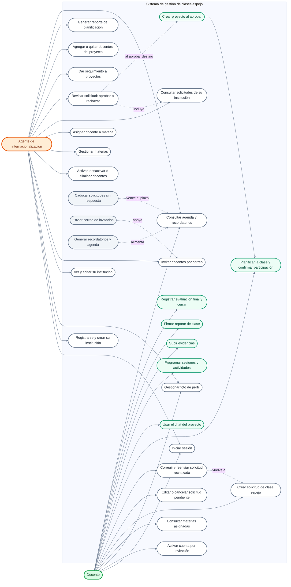

```mermaid
%%{init: {
    "theme": "base",
    "themeVariables": {
        "background": "#F5F7FA",
        "primaryTextColor": "#1F2937",
        "lineColor": "#64748B",
        "fontFamily": "Arial"
    }
}}%%

flowchart LR

    %% =========================
    %% ACTORES
    %% =========================

    Agente([Agente de internacionalización])
    Docente([Docente])

    %% =========================
    %% SISTEMA
    %% =========================

    subgraph Sistema["Sistema de gestión de clases espejo"]

        %% Autenticación y cuenta
        UC1([Iniciar sesión])
        UC2([Registrarse y crear su institución])
        UC3([Activar cuenta por invitación])
        UC4([Gestionar foto de perfil])

        %% Agente
        UC5([Ver y editar su institución])
        UC6([Invitar docentes por correo])
        UC7([Activar, desactivar o eliminar docentes])
        UC8([Gestionar materias])
        UC9([Asignar docente a materia])
        UC10([Consultar solicitudes de su institución])
        UC11([Revisar solicitud: aprobar o rechazar])
        UC12([Dar seguimiento a proyectos])
        UC13([Agregar o quitar docentes del proyecto])
        UC14([Generar reporte de planificación])

        %% Docente
        UC15([Consultar materias asignadas])
        UC16([Crear solicitud de clase espejo])
        UC17([Editar o cancelar solicitud pendiente])
        UC18([Corregir y reenviar solicitud rechazada])
        UC19([Planificar la clase y confirmar participación])
        UC20([Usar el chat del proyecto])
        UC21([Programar sesiones y actividades])
        UC22([Subir evidencias])
        UC23([Firmar reporte de clase])
        UC24([Registrar evaluación final y cerrar])
        UC25([Consultar agenda y recordatorios])

        %% Sistema (interno)
        UC26([Crear proyecto al aprobar])
        UC27([Caducar solicitudes sin respuesta])
        UC28([Enviar correo de invitación])
        UC29([Generar recordatorios y agenda])

    end

    %% =========================
    %% RELACIONES AGENTE
    %% =========================

    Agente --> UC1
    Agente --> UC2
    Agente --> UC4
    Agente --> UC5
    Agente --> UC6
    Agente --> UC7
    Agente --> UC8
    Agente --> UC9
    Agente --> UC10
    Agente --> UC11
    Agente --> UC12
    Agente --> UC13
    Agente --> UC14
    Agente --> UC25

    %% =========================
    %% RELACIONES DOCENTE
    %% =========================

    Docente --> UC1
    Docente --> UC3
    Docente --> UC4
    Docente --> UC15
    Docente --> UC16
    Docente --> UC17
    Docente --> UC18
    Docente --> UC19
    Docente --> UC20
    Docente --> UC21
    Docente --> UC22
    Docente --> UC23
    Docente --> UC24
    Docente --> UC25

    %% =========================
    %% RELACIONES INTERNAS
    %% =========================

    UC11 -. incluye .-> UC10
    UC11 -. "al aprobar destino" .-> UC26
    UC26 --> UC19

    UC27 -. "vence el plazo" .-> UC25
    UC28 -. "apoya" .-> UC6
    UC29 -. "alimenta" .-> UC25

    UC18 -. "vuelve a" .-> UC16

    %% =========================
    %% ESTILOS
    %% =========================

    classDef agente fill:#FFEDD5,stroke:#EA580C,color:#7C2D12,stroke-width:3px
    classDef docente fill:#DCFCE7,stroke:#16A34A,color:#14532D,stroke-width:3px

    class Agente agente
    class Docente docente

    classDef casoUso fill:#FFFFFF,stroke:#64748B,color:#1F2937,stroke-width:2px
    classDef sistema fill:#F1F5F9,stroke:#64748B,color:#334155,stroke-width:2px
    classDef proyecto fill:#ECFDF5,stroke:#059669,color:#064E3B,stroke-width:2px

    class UC1,UC2,UC3,UC4,UC5,UC6,UC7,UC8,UC9,UC10,UC11,UC12,UC13,UC14,UC15,UC16,UC17,UC18,UC19,UC20,UC21,UC22,UC23,UC24,UC25 casoUso
    class UC26,UC27,UC28,UC29 sistema
    class UC19,UC20,UC21,UC22,UC23,UC24,UC26 proyecto
```
