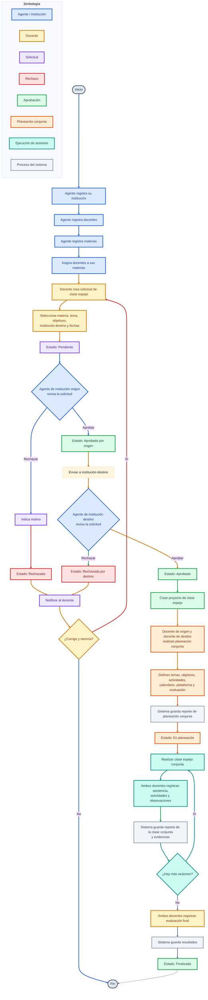

```mermaid
%%{init: {
    "theme": "base",
    "themeVariables": {
        "background": "#F5F7FA",
        "primaryTextColor": "#1F2937",
        "lineColor": "#64748B",
        "fontFamily": "Arial"
    }
}}%%

flowchart TD

    %% ==========================================
    %% FLUJO PRINCIPAL
    %% ==========================================

    A([Inicio]) --> B[Agente registra su institución]
    B --> C[Agente registra docentes]
    C --> D[Agente registra materias]
    D --> E[Asigna docentes a sus materias]

    E --> F[Docente crea solicitud de clase espejo]
    F --> G[Selecciona materia, tema, objetivos,<br/>institución destino y fechas]
    G --> H[Estado: Pendiente]

    H --> I{Agente de institución origen<br/>revisa la solicitud}

    I -->|Rechazar| J[Indica motivo]
    J --> K[Estado: Rechazada]
    K --> L[Notificar al docente]

    L --> M{¿Corrige y reenvía?}
    M -->|Sí| F
    M -->|No| Z([Fin])

    I -->|Aprobar| N[Estado: Aprobada por origen]
    N --> O[Enviar a institución destino]

    O --> P{Agente de institución destino<br/>revisa la solicitud}

    P -->|Rechazar| Q[Estado: Rechazada por destino]
    Q --> L

    P -->|Aprobar| R[Estado: Aprobada]

    R --> S[Crear proyecto de clase espejo]

    S --> T[Docente de origen y docente de destino<br/>realizan planeación conjunta]

    T --> U[Definen temas, objetivos, actividades,<br/>calendario, plataforma y evaluación]

    U --> V[Sistema guarda reporte de planeación conjunta]

    V --> W[Estado: En planeación]

    W --> X[Realizar clase espejo conjunta]

    X --> Y[Ambos docentes registran asistencia,<br/>actividades y observaciones]

    Y --> AA[Sistema guarda reporte de la clase conjunta<br/>y evidencias]

    AA --> AB{¿Hay más sesiones?}

    AB -->|Sí| X
    AB -->|No| AC[Ambos docentes registran evaluación final]

    AC --> AD[Sistema guarda resultados]

    AD --> AE[Estado: Finalizada]

    AE --> Z


    %% ==========================================
    %% ESTILOS
    %% ==========================================

    %% Inicio / Fin
    classDef inicioFin fill:#E2E8F0,stroke:#475569,color:#1E293B,stroke-width:3px

    %% Agente / institución
    classDef agente fill:#DBEAFE,stroke:#2563EB,color:#1E3A8A,stroke-width:3px

    %% Docente
    classDef docente fill:#FEF3C7,stroke:#D97706,color:#78350F,stroke-width:3px

    %% Solicitud
    classDef solicitud fill:#EDE9FE,stroke:#7C3AED,color:#4C1D95,stroke-width:3px

    %% Rechazo
    classDef rechazo fill:#FEE2E2,stroke:#DC2626,color:#7F1D1D,stroke-width:3px

    %% Aprobación
    classDef aprobado fill:#DCFCE7,stroke:#16A34A,color:#14532D,stroke-width:3px

    %% Planeación
    classDef planeacion fill:#FFEDD5,stroke:#EA580C,color:#7C2D12,stroke-width:3px

    %% Ejecución
    classDef ejecucion fill:#CCFBF1,stroke:#0D9488,color:#134E4A,stroke-width:3px

    %% Sistema
    classDef sistema fill:#F1F5F9,stroke:#64748B,color:#334155,stroke-width:2px


    %% ==========================================
    %% APLICAR ESTILOS
    %% ==========================================

    class A,Z inicioFin

    class B,C,D,E,I,P agente

    class F,G,M,T,U,X,Y,AC docente

    class H,J,L,Q solicitud

    class K,Q rechazo

    class N,R,S,AE aprobado

    class T,U,W planeacion

    class X,Y,AB ejecucion

    class V,AA,AD sistema


    %% ==========================================
    %% FLECHAS - AGENTE
    %% ==========================================

    linkStyle 0,1,2,3,7,8,13,14 stroke:#2563EB,stroke-width:3px


    %% ==========================================
    %% FLECHAS - DOCENTE
    %% ==========================================

    linkStyle 4,5,6,10,11,15,16,18,19,21,22 stroke:#D97706,stroke-width:3px


    %% ==========================================
    %% FLECHAS - RECHAZO
    %% ==========================================

    linkStyle 9,12 stroke:#DC2626,stroke-width:3px


    %% ==========================================
    %% FLECHAS - APROBACIÓN
    %% ==========================================

    linkStyle 17,20,27 stroke:#16A34A,stroke-width:3px


    %% ==========================================
    %% FLECHAS - PLANEACIÓN
    %% ==========================================

    linkStyle 23,24,25 stroke:#EA580C,stroke-width:3px


    %% ==========================================
    %% FLECHAS - EJECUCIÓN
    %% ==========================================

    linkStyle 26,28,29 stroke:#0D9488,stroke-width:3px


    %% ==========================================
    %% FLECHAS - SISTEMA
    %% ==========================================

    linkStyle 30,31,32 stroke:#64748B,stroke-width:3px


    %% ==========================================
    %% LEYENDA
    %% ==========================================

    subgraph Leyenda["Simbología"]

        L1[Agente / Institución]
        L2[Docente]
        L3[Solicitud]
        L4[Rechazo]
        L5[Aprobación]
        L6[Planeación conjunta]
        L7[Ejecución de sesiones]
        L8[Proceso del sistema]

    end

    class L1 agente
    class L2 docente
    class L3 solicitud
    class L4 rechazo
    class L5 aprobado
    class L6 planeacion
    class L7 ejecucion
    class L8 sistema
```