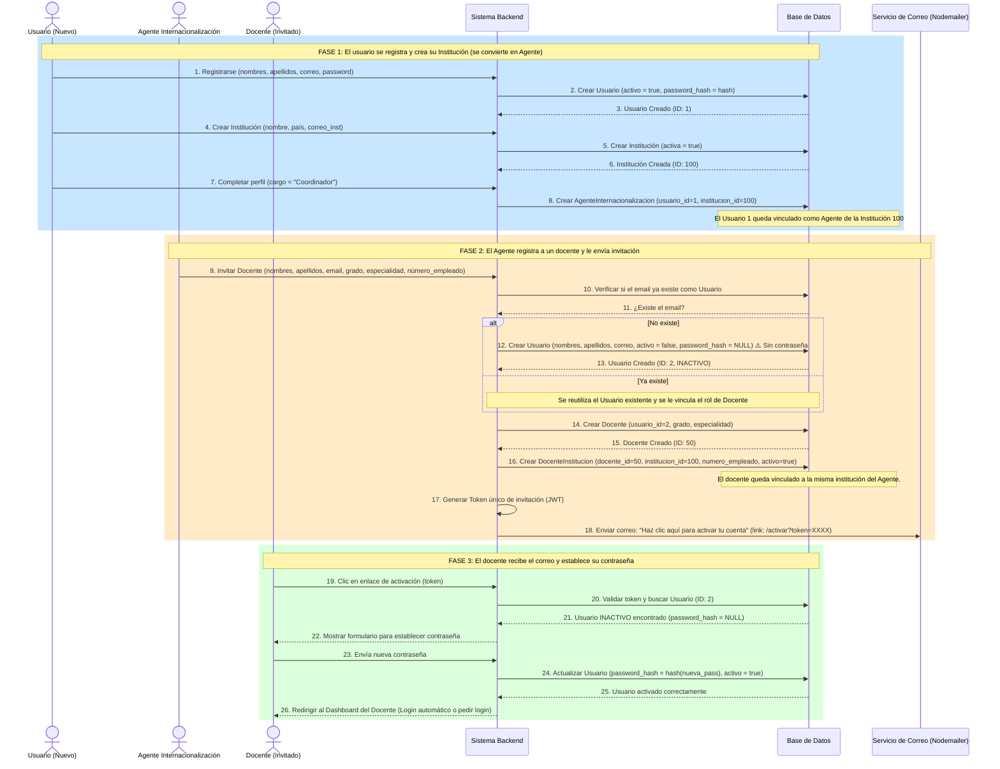

```mermaid
sequenceDiagram
    actor UsuarioWeb as Usuario (Nuevo)
    actor Agente as Agente Internacionalización
    actor DocenteInv as Docente (Invitado)
    participant Sistema as Sistema Backend
    participant BD as Base de Datos
    participant Email as Servicio de Correo (Nodemailer)

    %% ==================== FASE 1: REGISTRO DE AGENTE E INSTITUCIÓN ====================
    rect rgb(200, 230, 255)
        Note over UsuarioWeb,BD: FASE 1: El usuario se registra y crea su Institución (se convierte en Agente)
        UsuarioWeb->>Sistema: 1. Registrarse (nombres, apellidos, correo, password)
        Sistema->>BD: 2. Crear Usuario (activo = true, password_hash = hash)
        BD-->>Sistema: 3. Usuario Creado (ID: 1)

        UsuarioWeb->>Sistema: 4. Crear Institución (nombre, país, correo_inst)
        Sistema->>BD: 5. Crear Institución (activa = true)
        BD-->>Sistema: 6. Institución Creada (ID: 100)

        UsuarioWeb->>Sistema: 7. Completar perfil (cargo = "Coordinador")
        Sistema->>BD: 8. Crear AgenteInternacionalizacion (usuario_id=1, institucion_id=100)
        Note over BD: El Usuario 1 queda vinculado como Agente de la Institución 100
    end

    %% ==================== FASE 2: AGENTE INVITA A DOCENTE ====================
    rect rgb(255, 235, 200)
        Note over Agente,Email: FASE 2: El Agente registra a un docente y le envía invitación
        Agente->>Sistema: 9. Invitar Docente (nombres, apellidos, email, grado, especialidad, número_empleado)

        Sistema->>BD: 10. Verificar si el email ya existe como Usuario
        BD-->>Sistema: 11. ¿Existe el email?

        alt No existe
            Sistema->>BD: 12. Crear Usuario (nombres, apellidos, correo, activo = false, password_hash = NULL) ⚠️ Sin contraseña
            BD-->>Sistema: 13. Usuario Creado (ID: 2, INACTIVO)
        else Ya existe
            Note over Sistema,BD: Se reutiliza el Usuario existente y se le vincula el rol de Docente
        end

        Sistema->>BD: 14. Crear Docente (usuario_id=2, grado, especialidad)
        BD-->>Sistema: 15. Docente Creado (ID: 50)

        Sistema->>BD: 16. Crear DocenteInstitucion (docente_id=50, institucion_id=100, numero_empleado, activo=true)
        Note over BD: El docente queda vinculado a la misma institución del Agente.

        Sistema->>Sistema: 17. Generar Token único de invitación (JWT)
        Sistema->>Email: 18. Enviar correo: "Haz clic aquí para activar tu cuenta" (link: /activar?token=XXXX)
    end

    %% ==================== FASE 3: DOCENTE ACTIVA SU CUENTA ====================
    rect rgb(220, 255, 220)
        Note over DocenteInv,BD: FASE 3: El docente recibe el correo y establece su contraseña
        DocenteInv->>Sistema: 19. Clic en enlace de activación (token)
        Sistema->>BD: 20. Validar token y buscar Usuario (ID: 2)
        BD-->>Sistema: 21. Usuario INACTIVO encontrado (password_hash = NULL)

        Sistema-->>DocenteInv: 22. Mostrar formulario para establecer contraseña
        DocenteInv->>Sistema: 23. Envía nueva contraseña

        Sistema->>BD: 24. Actualizar Usuario (password_hash = hash(nueva_pass), activo = true)
        BD-->>Sistema: 25. Usuario activado correctamente

        Sistema-->>DocenteInv: 26. Redirigir al Dashboard del Docente (Login automático o pedir login)
    end
```
