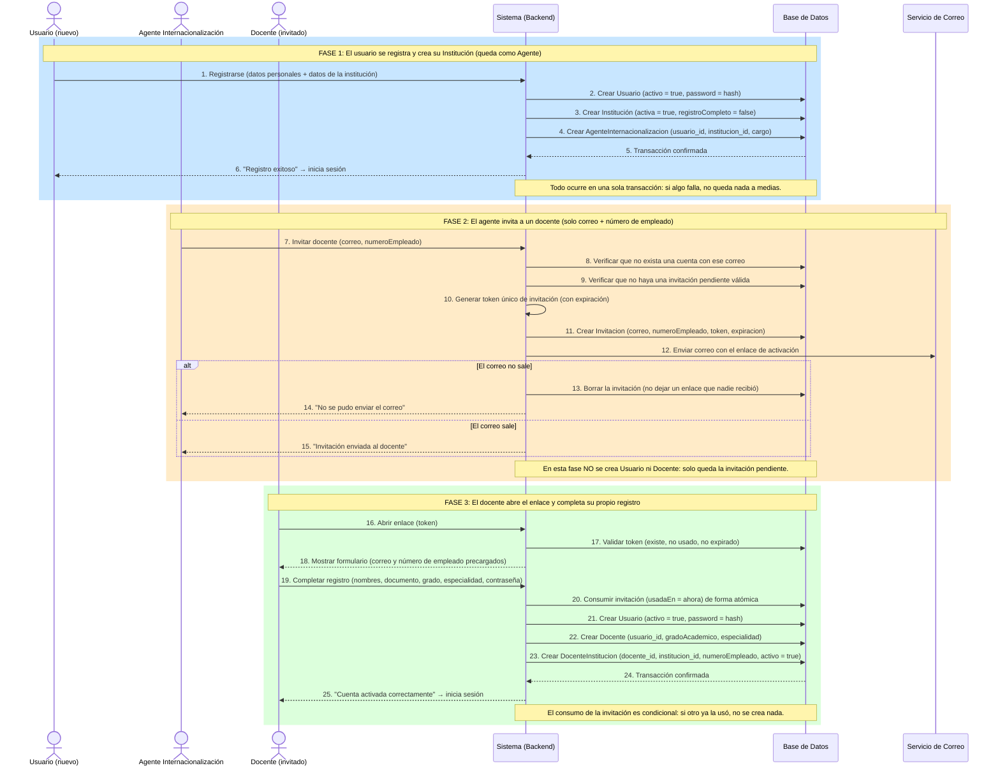

```mermaid
sequenceDiagram
    actor UsuarioNuevo as Usuario (nuevo)
    actor Agente as Agente Internacionalización
    actor DocenteInv as Docente (invitado)
    participant Sistema as Sistema (Backend)
    participant BD as Base de Datos
    participant Correo as Servicio de Correo

    %% ==================== FASE 1: REGISTRO DE AGENTE E INSTITUCIÓN ====================
    rect rgb(200, 230, 255)
        Note over UsuarioNuevo,BD: FASE 1: El usuario se registra y crea su Institución (queda como Agente)

        UsuarioNuevo->>Sistema: 1. Registrarse (datos personales + datos de la institución)
        Sistema->>BD: 2. Crear Usuario (activo = true, password = hash)
        Sistema->>BD: 3. Crear Institución (activa = true, registroCompleto = false)
        Sistema->>BD: 4. Crear AgenteInternacionalizacion (usuario_id, institucion_id, cargo)
        BD-->>Sistema: 5. Transacción confirmada
        Sistema-->>UsuarioNuevo: 6. "Registro exitoso" → inicia sesión

        Note over Sistema,BD: Todo ocurre en una sola transacción: si algo falla, no queda nada a medias.
    end

    %% ==================== FASE 2: INVITACIÓN DEL DOCENTE ====================
    rect rgb(255, 235, 200)
        Note over Agente,Correo: FASE 2: El agente invita a un docente (solo correo + número de empleado)

        Agente->>Sistema: 7. Invitar docente (correo, numeroEmpleado)
        Sistema->>BD: 8. Verificar que no exista una cuenta con ese correo
        Sistema->>BD: 9. Verificar que no haya una invitación pendiente válida
        Sistema->>Sistema: 10. Generar token único de invitación (con expiración)
        Sistema->>BD: 11. Crear Invitacion (correo, numeroEmpleado, token, expiracion)
        Sistema->>Correo: 12. Enviar correo con el enlace de activación

        alt El correo no sale
            Sistema->>BD: 13. Borrar la invitación (no dejar un enlace que nadie recibió)
            Sistema-->>Agente: 14. "No se pudo enviar el correo"
        else El correo sale
            Sistema-->>Agente: 15. "Invitación enviada al docente"
        end

        Note over Sistema,BD: En esta fase NO se crea Usuario ni Docente: solo queda la invitación pendiente.
    end

    %% ==================== FASE 3: ACTIVACIÓN DEL DOCENTE ====================
    rect rgb(220, 255, 220)
        Note over DocenteInv,BD: FASE 3: El docente abre el enlace y completa su propio registro

        DocenteInv->>Sistema: 16. Abrir enlace (token)
        Sistema->>BD: 17. Validar token (existe, no usado, no expirado)
        Sistema-->>DocenteInv: 18. Mostrar formulario (correo y número de empleado precargados)

        DocenteInv->>Sistema: 19. Completar registro (nombres, documento, grado, especialidad, contraseña)
        Sistema->>BD: 20. Consumir invitación (usadaEn = ahora) de forma atómica
        Sistema->>BD: 21. Crear Usuario (activo = true, password = hash)
        Sistema->>BD: 22. Crear Docente (usuario_id, gradoAcademico, especialidad)
        Sistema->>BD: 23. Crear DocenteInstitucion (docente_id, institucion_id, numeroEmpleado, activo = true)
        BD-->>Sistema: 24. Transacción confirmada
        Sistema-->>DocenteInv: 25. "Cuenta activada correctamente" → inicia sesión

        Note over Sistema,BD: El consumo de la invitación es condicional: si otro ya la usó, no se crea nada.
    end
```
