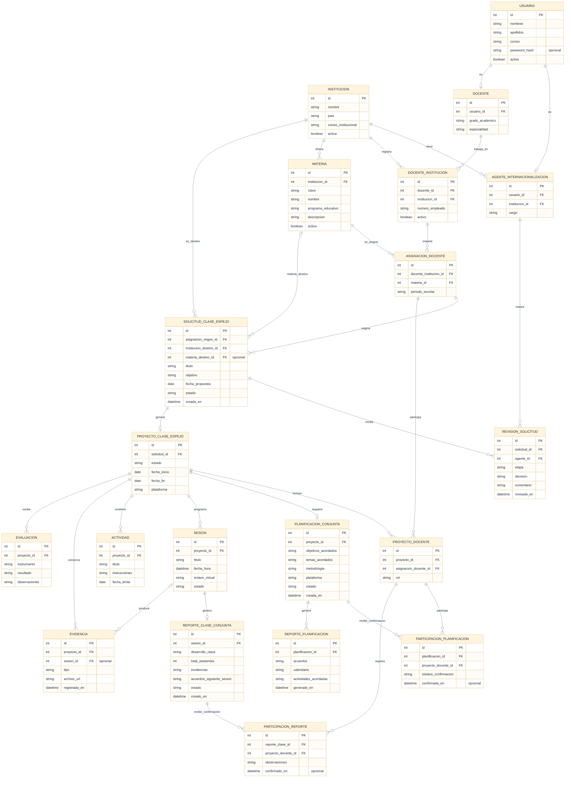

```mermaid
%%{init: {
    "theme": "base",
    "themeVariables": {
        "background": "#F5F7FA",
        "primaryTextColor": "#1F2937",
        "lineColor": "#64748B",
        "fontFamily": "Arial",

        "er.entityBox": "#FFFFFF",
        "er.entityBorder": "#475569",
        "er.attributeBoxOdd": "#F8FAFC",
        "er.attributeBoxEven": "#EEF2F7",
        "er.attributeBorder": "#CBD5E1",
        "er.relationshipLabelBox": "#FFFFFF",
        "er.relationshipLabelColor": "#334155"
    }
}}%%

erDiagram
    INSTITUCION {
        int id PK
        string nombre
        string pais
        string correo_institucional
        boolean activa
    }

    USUARIO {
        int id PK
        string nombres
        string apellidos
        string correo
        string password_hash "opcional"
        boolean activo
    }

    AGENTE_INTERNACIONALIZACION {
        int id PK
        int usuario_id FK
        int institucion_id FK
        string cargo
    }

    DOCENTE {
        int id PK
        int usuario_id FK
        string grado_academico
        string especialidad
    }

    DOCENTE_INSTITUCION {
        int id PK
        int docente_id FK
        int institucion_id FK
        string numero_empleado
        boolean activo
    }

    MATERIA {
        int id PK
        int institucion_id FK
        string clave
        string nombre
        string programa_educativo
        string descripcion
        boolean activa
    }

    ASIGNACION_DOCENTE {
        int id PK
        int docente_institucion_id FK
        int materia_id FK
        string periodo_escolar
    }

    SOLICITUD_CLASE_ESPEJO {
        int id PK
        int asignacion_origen_id FK
        int institucion_destino_id FK
        int materia_destino_id FK "opcional"
        string titulo
        string objetivo
        date fecha_propuesta
        string estado
        datetime creada_en
    }

    REVISION_SOLICITUD {
        int id PK
        int solicitud_id FK
        int agente_id FK
        string etapa
        string decision
        string comentario
        datetime revisada_en
    }

    PROYECTO_CLASE_ESPEJO {
        int id PK
        int solicitud_id FK
        string estado
        date fecha_inicio
        date fecha_fin
        string plataforma
    }

    PROYECTO_DOCENTE {
        int id PK
        int proyecto_id FK
        int asignacion_docente_id FK
        string rol
    }

    PLANIFICACION_CONJUNTA {
        int id PK
        int proyecto_id FK
        string objetivos_acordados
        string temas_acordados
        string metodologia
        string plataforma
        string estado
        datetime creada_en
    }

    PARTICIPACION_PLANIFICACION {
        int id PK
        int planificacion_id FK
        int proyecto_docente_id FK
        string estatus_confirmacion
        datetime confirmada_en "opcional"
    }

    REPORTE_PLANIFICACION {
        int id PK
        int planificacion_id FK
        string acuerdos
        string calendario
        string actividades_acordadas
        datetime generado_en
    }

    SESION {
        int id PK
        int proyecto_id FK
        string titulo
        datetime fecha_hora
        string enlace_virtual
        string estado
    }

    ACTIVIDAD {
        int id PK
        int proyecto_id FK
        string titulo
        string instrucciones
        date fecha_limite
    }

    REPORTE_CLASE_CONJUNTA {
        int id PK
        int sesion_id FK
        string desarrollo_clase
        int total_asistentes
        string incidencias
        string acuerdos_siguiente_sesion
        string estado
        datetime creado_en
    }

    PARTICIPACION_REPORTE {
        int id PK
        int reporte_clase_id FK
        int proyecto_docente_id FK
        string observaciones
        datetime confirmado_en "opcional"
    }

    EVIDENCIA {
        int id PK
        int proyecto_id FK
        int sesion_id FK "opcional"
        string tipo
        string archivo_url
        datetime registrada_en
    }

    EVALUACION {
        int id PK
        int proyecto_id FK
        string instrumento
        string resultado
        string observaciones
    }

    INSTITUCION ||--o{ AGENTE_INTERNACIONALIZACION : tiene
    USUARIO ||--o| AGENTE_INTERNACIONALIZACION : es
    USUARIO ||--o| DOCENTE : es

    DOCENTE ||--o{ DOCENTE_INSTITUCION : trabaja_en
    INSTITUCION ||--o{ DOCENTE_INSTITUCION : registra

    INSTITUCION ||--o{ MATERIA : ofrece
    DOCENTE_INSTITUCION ||--o{ ASIGNACION_DOCENTE : imparte
    MATERIA ||--o{ ASIGNACION_DOCENTE : se_asigna

    ASIGNACION_DOCENTE ||--o{ SOLICITUD_CLASE_ESPEJO : origina
    INSTITUCION ||--o{ SOLICITUD_CLASE_ESPEJO : es_destino
    MATERIA o|--o{ SOLICITUD_CLASE_ESPEJO : materia_destino

    SOLICITUD_CLASE_ESPEJO ||--o{ REVISION_SOLICITUD : recibe
    AGENTE_INTERNACIONALIZACION ||--o{ REVISION_SOLICITUD : realiza

    SOLICITUD_CLASE_ESPEJO ||--o| PROYECTO_CLASE_ESPEJO : genera
    PROYECTO_CLASE_ESPEJO ||--o{ PROYECTO_DOCENTE : incluye
    ASIGNACION_DOCENTE ||--o{ PROYECTO_DOCENTE : participa

    PROYECTO_CLASE_ESPEJO ||--o| PLANIFICACION_CONJUNTA : requiere
    PLANIFICACION_CONJUNTA ||--o{ PARTICIPACION_PLANIFICACION : recibe_confirmacion
    PROYECTO_DOCENTE ||--o{ PARTICIPACION_PLANIFICACION : participa

    PLANIFICACION_CONJUNTA ||--o{ REPORTE_PLANIFICACION : genera

    PROYECTO_CLASE_ESPEJO ||--o{ SESION : programa
    PROYECTO_CLASE_ESPEJO ||--o{ ACTIVIDAD : contiene

    SESION ||--o| REPORTE_CLASE_CONJUNTA : genera
    REPORTE_CLASE_CONJUNTA ||--o{ PARTICIPACION_REPORTE : recibe_confirmacion
    PROYECTO_DOCENTE ||--o{ PARTICIPACION_REPORTE : registra

    PROYECTO_CLASE_ESPEJO ||--o{ EVIDENCIA : conserva
    SESION o|--o{ EVIDENCIA : produce

    PROYECTO_CLASE_ESPEJO ||--o{ EVALUACION : recibe
```