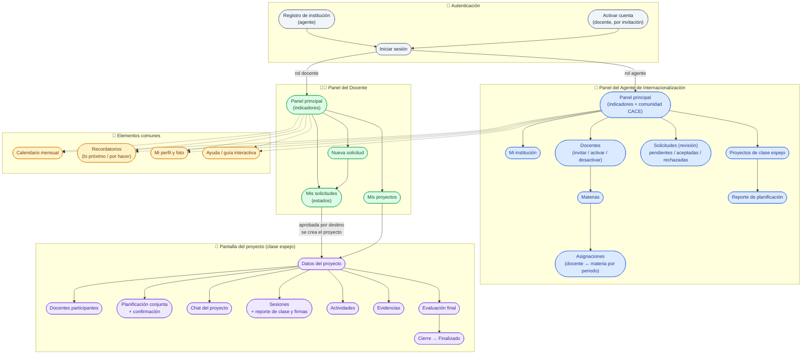

# Mapa de pantallas y navegación — Clases Conjuntas (Figura 2.5)

```mermaid
flowchart TD
    %% ============ AUTENTICACIÓN ============
    subgraph AUTH["🔐 Autenticación"]
        A1(["Iniciar sesión"])
        A2(["Registro de institución<br/>(agente)"])
        A3(["Activar cuenta<br/>(docente, por invitación)"])
    end

    %% ============ PANEL DEL AGENTE ============
    subgraph AGENTE["👔 Panel del Agente de Internacionalización"]
        G1(["Panel principal<br/>(indicadores + comunidad CACE)"])
        G2(["Mi institución"])
        G3(["Docentes<br/>(invitar / activar / desactivar)"])
        G4(["Materias"])
        G5(["Asignaciones<br/>(docente ↔ materia por periodo)"])
        G6(["Solicitudes (revisión)<br/>pendientes / aceptadas / rechazadas"])
        G7(["Proyectos de clase espejo"])
        G8(["Reporte de planificación"])
    end

    %% ============ PANEL DEL DOCENTE ============
    subgraph DOCENTE["🧑‍🏫 Panel del Docente"]
        D1(["Panel principal<br/>(indicadores)"])
        D2(["Nueva solicitud"])
        D3(["Mis solicitudes<br/>(estados)"])
        D4(["Mis proyectos"])
    end

    %% ============ PROYECTO (CLASE ESPEJO) ============
    subgraph PROYECTO["📘 Pantalla del proyecto (clase espejo)"]
        P1(["Datos del proyecto"])
        P2(["Docentes participantes"])
        P3(["Planificación conjunta<br/>+ confirmación"])
        P4(["Chat del proyecto"])
        P5(["Sesiones<br/>+ reporte de clase y firmas"])
        P6(["Actividades"])
        P7(["Evidencias"])
        P8(["Evaluación final"])
        P9(["Cierre → Finalizado"])
    end

    %% ============ ELEMENTOS COMUNES ============
    subgraph COMUN["🔔 Elementos comunes"]
        C1(["Calendario mensual"])
        C2(["Recordatorios<br/>(lo próximo / por hacer)"])
        C3(["Mi perfil y foto"])
        C4(["Ayuda / guía interactiva"])
    end

    %% ============ NAVEGACIÓN ============
    A2 --> A1
    A3 --> A1
    A1 -->|"rol agente"| G1
    A1 -->|"rol docente"| D1

    G1 --> G2
    G1 --> G3
    G3 --> G4
    G4 --> G5
    G1 --> G6
    G1 --> G7
    G7 --> G8

    D1 --> D2
    D1 --> D3
    D1 --> D4
    D2 --> D3
    D3 -->|"aprobada por destino<br/>se crea el proyecto"| P1
    D4 --> P1

    P1 --> P2
    P1 --> P3
    P1 --> P4
    P1 --> P5
    P1 --> P6
    P1 --> P7
    P1 --> P8
    P8 --> P9

    G1 -.-> C1
    D1 -.-> C1
    G1 -.-> C2
    D1 -.-> C2
    G1 -.-> C3
    D1 -.-> C3
    G1 -.-> C4
    D1 -.-> C4

    %% ============ ESTILOS ============
    classDef auth fill:#F1F5F9,stroke:#64748B,color:#1E293B
    classDef agente fill:#DBEAFE,stroke:#2563EB,color:#1E3A8A
    classDef docente fill:#DCFCE7,stroke:#16A34A,color:#14532D
    classDef proyecto fill:#EDE9FE,stroke:#7C3AED,color:#4C1D95
    classDef comun fill:#FEF3C7,stroke:#D97706,color:#78350F

    class A1,A2,A3 auth
    class G1,G2,G3,G4,G5,G6,G7,G8 agente
    class D1,D2,D3,D4 docente
    class P1,P2,P3,P4,P5,P6,P7,P8,P9 proyecto
    class C1,C2,C3,C4 comun
```
